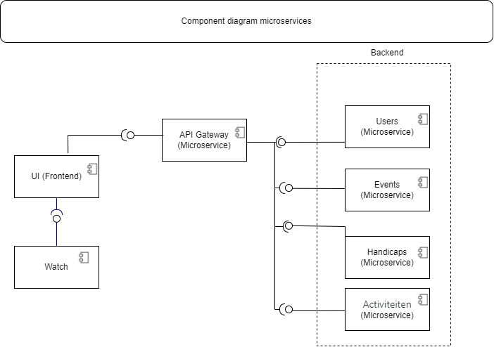
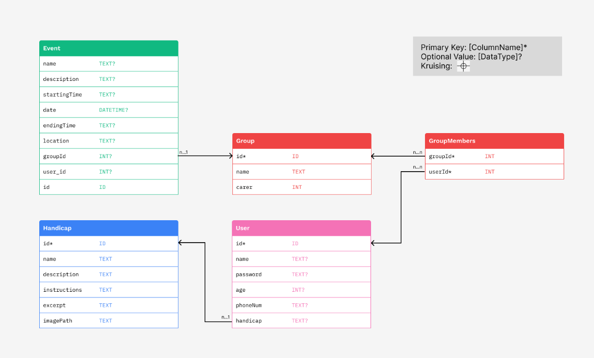

# AbilityLink Backend

Dit project bevat de back-end van de abilitylink applicatie.
Zowel de technische beschrijving als mogelijke routes staan beschreven in dit document,
Als ook de installatiewijze van de verschillende onderdelen.
Als laatste zal er worden gekeken naar de verantwoordelijkheden van de verschillende teamleden.

## Project

AbilityLink heeft als doel de communicatie tussen organisaties en beperkten te verbeteren.
In een wereld waar beperkten mensen mee willen doen aan fysieke activiteiten,
is het soms moeilijk voor begeleiders om op de juiste manier om te gaan met de deelnemers.
Deze applicatie probeert om het gat tussen de partijen kleiner te maken,
waardoor iedereen meer genot en effect uit de activiteiten kan halen.
De app is ontworpen met de volgende belangrijke doelstellingen in gedachten:

- AbilityLink is specifiek ontworpen om toegankelijk te zijn voor mensen met diverse beperkingen. 
De app biedt aanpasbare functies en ondersteunt verschillende communicatiemodi om een inclusieve ervaring te waarborgen.
- Zorgplanning en Activiteitenbeheer. De app bevat functies voor het plannen en beheren van activiteiten. 
Zorgbegeleiders kunnen activiteiten toewijzen aan groepen, 
en zowel begeleiders als deelnemers kunnen deze activiteiten zien in hun agenda. 
Dit bevordert een georganiseerde en gestructureerde benadering van zorg en stimuleert de deelnemers om actiever deel te nemen aan de activiteiten.
- Zorgplanning en Activiteitenbeheer. De app bevat functies voor het plannen en beheren van activiteiten. 
Zorgbegeleiders kunnen activiteiten toewijzen aan groepen, en zowel begeleiders als deelnemers kunnen deze activiteiten zien in hun agenda. 
Dit bevordert een georganiseerde en gestructureerde benadering van zorg en stimuleert de deelnemers om actiever deel te nemen aan de activiteiten.

## Overview

Om de applicatie te maken wordt er gebruik gemaakt van een (soort van) micro-services architectuur.
Ieder onderdeel van de applicatie heeft een afgescherme omgeving,
met een eigen database; server en applicatie.
Op deze manier worden de onderdelen minder afhankelijk van elkaar,
met de mogelijkheid om ze apart van elkaar te ontwikkelen.
Om communicatie mogelijk te maken wordt er gebruik gemaakt van een Gateway.
De applicatie bestaat uit de volgende gateways:



Microservice | Technologie                    | Database | Port | Versie | Kleur
-------------|--------------------------------|----------|------|--------|-------
Gateway      | NodeJS, Express, Axios, Cors   | Json     | 3000 | 1.2.0  | N.v.t.
Events       | NodeJS, Express, Cors, Sqlite3 | Sqlite   | 3010 | 1.1.0  | Groen
Groups       | NodeJS, Express, Cors, Sqlite3 | Sqlite   | 3012 | 1.1.0  | Rood
Login        | NodeJS, Express, Cors, Sqlite3 | Sqlite   | 3011 | 1.0.0  | Roze
Handicaps    | NodeJS, Express, Cors, Sqlite3 | Sqlite   | 3015 | 1.0.0  | Blauw


Vanwege de gescheiden natuur van de applicatie, heeft iedere service een eigen database.
Hoewel de databases opgedeeld zijn, zijn de tabellen nog steeds afhankelijk van elkaar.
Dit is goed te zien in het volgende ERD-diagram.
In dit diagram hebben de tabellen een kleur die hoort bij de betreffende service,
deze zijn terug te vinden in de bovenstaande tabel.



## Afhankelijkheden

De verschillende onderdelen maken gebruik van de volgende afhankelijkheden.
Dit zijn de externe pakketten die gebruikt worden om de applicatie te laten werken.
Zowel de paketten als de gebruikte versies worden in dit hoofdstuk beschreven.

- Gateway
    - Node (20.10.0)
    - **Development:** Jest (29.7.0), Nodemon (3.0.1)
    - **Production:** Axios (1.6.2), Cors (2.8.5), Express (4.18.2)
- Events
    - Node 20.10.0
    - **Development:** Jest (29.7.0)
    - **Production:** Cors (2.8.5), Express (4.18.2), Sqlite3 (5.1.6), Nodemon (3.0.1)
- Groups
    - Node 20.10.0
    - **Production:** Cors (2.8.5), Express (4.18.2), Sqlite3 (5.1.6), Nodemon (3.0.1)
- Login
    - Node 20.10.0
    - **Development:** Jest (29.7.0)
    - **Production:** Axios (1.6.2), Bcrypt (5.1.1), Cors (2.8.5), Express (4.18.2), Nodemon (3.0.1), Sqlite3 (5.1.6)
- Handicaps
    - Node 20.10.0
    - **Development:** Cors (2.8.5), Express (4.18.2), Sqlite3 (5.1.6)
    - **Production:** Jest (29.7.0), Nodemon (3.0.1)

## Uitvoeren

De applicatie op dit moment kan worden gebruikt doormiddel van docker of NPM.

```bash
# Docker
docker compose up

# NPM
npm install
npm run dev     # Gateway
npm run watch   # Events, Groups, Login & Handicaps
```

## Credits

Microservice | Eigenaar     | Development
-------------|--------------|----------------------------------------------------------
Gateway      | djairo27     | djairo27, Jimmaphy
Events       | erjbroek     | erjbroek, Lardo-tech, ItsDimitrie, Ali-A-Hamdan, Jimmaphy
Groups       | Ali-A-Hamdan | Ali-A-Hamdan, Lardo-tech, erjbroek
Login        | Willem-Arie  | Willem-Arie, djairo27, ItsDimitrie
Handicaps    | Jimmaphy     | Jimmaphy